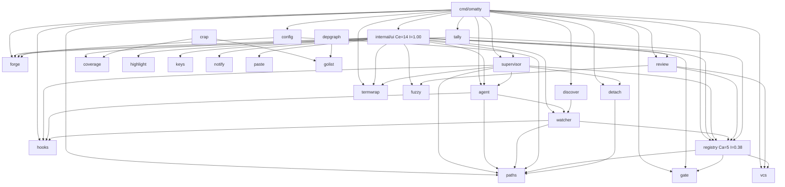

# Architecture audit (Phase 0)

> **Done.** ADR 0001 (#618) answered this audit and `docs/MIGRATION_PLAN.md`
> carried it out (#653, completed 2026-10-01). The page is kept as the record
> of the code before the migration; its line references are to that code, and
> `docs/ARCHITECTURE.md` describes the code as it is.

Captured 2026-09-29 against `develop` @ `1243cb2` (v0.9.0 plus the M16 docs), for
#615. This is read-only discovery. It proposes no design; that is Phase 1, an
ADR, and it waits on review of this page.

Line references are to `develop` @ `1243cb2`. #611 and #612 move some of the
cited declarations between files without changing them (#609):
`model.go:391-652` → `msgroute.go`, `model.go:654-718` → `resize.go`, and the
titles and coverage marks out of `reviewview.go` and the rows and rendering out
of `tracker.go`.

Every number below came from a command run for this page. The commands are
listed with each section so the next pass re-runs them rather than trusting
them.

## Current state

### Size

`go list` plus `wc -l`, production lines only:

| Package | Files | LOC | Test LOC |
|---|---:|---:|---:|
| `internal/ui` | 85 | 14,487 | 19,838 |
| `internal/forge` | 40 | 5,149 | 6,042 |
| `internal/review` | 19 | 1,843 | 2,449 |
| `cmd/omatty` | 8 | 1,282 | 1,112 |
| `internal/registry` | 9 | 1,269 | 2,191 |
| `internal/termwrap` | 8 | 1,112 | 1,032 |
| `internal/watcher` | 8 | 975 | 1,403 |
| `internal/gate` | 8 | 908 | 1,361 |
| the other 20 packages, incl. `tools/` | 50 | 5,052 | — |

`internal/ui` is 45% of the production code (32,077 lines) and 85 of 235
production files.
It has 818 top-level functions, 518 of them methods on `*Model`.

### Import graph

`go list -f '{{.ImportPath}}: {{join .Imports " "}}' ./...`, filtered to the
module and to production imports: 41 internal edges.

`./scripts/check-deps.sh`: **no edge against the direction of stability**. The
tightest edge is `agent → watcher` at a margin of +0.100 over 41 edges.

### Classification

Classified against the reference's domain / service / infra / tui split. The
reference's names are used for comparison only; they are not a proposal.

| Class | Packages | Note |
|---|---|---|
| domain (no internal imports) | `paths`, `fuzzy`, `paste`, `keys`, `coverage` | stdlib only; `coverage.Load` reads a file, the rest is pure |
| domain over another package's types | `tally` (→ `forge`, `registry`), `crap` and `depgraph` (→ `golist`) | pure computation, fed types an infra package produces |
| infra (drives a process or the network) | `vcs`, `forge`, `detach`, `termwrap`, `golist`, `notify`, `highlight`, `hooks` | each is the one owner of its CLI or library, fenced by depguard |
| service-shaped | `watcher`, `gate`, `supervisor`, `discover`, `agent` | orchestrate infra into typed events or verdicts |
| **mixed** | `registry`, `review` | see "Where the boundaries leak" below |
| tui | `ui` | also a second composition root; see pain point 2 |
| composition root | `cmd/omatty` | `wiring.go` builds everything |

## What already holds

These are real strengths. Phase 1 should build on them, not re-solve them.

- **Every third-party library and CLI has one owner**, and depguard enforces
  it: bubbleterm/pty → `termwrap`, chroma → `highlight`, go-gitdiff → `review`,
  bubbletea → `ui` + `termwrap`, `os/exec` → 8 packages, `net/http` → `forge`.
  git and the forge CLIs are string literals rather than imports, so
  `TestNoGitOutsideVcs` and `TestNoGhOutsideForge` fence them.
- **The core never imports bubbletea.** Only `ui` and `termwrap` do, and
  depguard enforces it (#260).
- **No `p.Send` and no global channels.** External streams are re-armed
  blocking Cmds: `ui/status.go:29` (`waitForEvent`) and `ui/gaterun.go:26`
  (`waitForGate`). Timers are `tea.Tick` chains started in `Init`.
- **No mutable package state** beyond `cmd/omatty/version.go:13`, which the
  linker sets. Package-level vars are lookup tables, regexps, errors, styles and
  `sync.OnceValue` caches.
- **Most I/O is already in a Cmd.** There are 27 `func() tea.Msg` sites in
  `ui`, and no direct `os.*`, `exec.*` or `net/http` in any `ui` production file.
- **The SDP gate exists and is green.**

## Where the boundaries leak

Measured against the reference rule (`tui → service → domain`; `infra` behind
ports; `cmd` the only composition root). None of these are violations of *this
repository's* enforced rules. They are where the reference rule and the code
disagree.

1. **`ui` depends on infra directly.** It imports `supervisor`, `termwrap`,
   `watcher`, `gate` and `forge` (the edges above), and on concrete types, not
   ports it declares: for example `termwrap.Terminal` in `Model.terms`, and
   `forge.PR` in the tracker rows. `termwrap` is a deliberate exception: it is
   a bubbletea component itself (AGENTS.md "Repository layout").
2. **`ui` is a second composition root.** `ui/run.go:186` (`Run`) starts the
   PTYs (`StartTerminals`), `watcher.Start` and `gate.NewRunner`.
   `ui/run.go:206` (`modelFor`) then copies `RunDeps` (41 fields,
   `run.go:101`) into `Deps` (46 fields, `deps.go:67`) field by field. This
   contradicts invariant 10's intent that `cmd` constructs dependencies.
3. **`registry` reaches down to infra and sideways to a service.** It imports
   `vcs` (worktree creation lives in `registry.NewCreator`, built at
   `cmd/omatty/wiring.go:388`) and `gate` (for the `gate.Step` type in
   `Project.Gate`). The state store and git side effects share one package.
4. **`review` mixes the diff model with file I/O.** `review.ReadPreview` is
   the default `Deps.Preview` (`ui/deps.go` `withDefaults`), next to the pure
   parse, pair and compose logic. It also imports `registry` and `vcs`.
5. **Blocking I/O on the event loop.** These run synchronously inside `Update`,
   not in a Cmd:
   - `ui/sessionlife.go:90` `m.create`, which runs `git worktree add` via the
     registry creator
   - `ui/sessionlife.go:44,107` `m.start`, which spawns the PTY and dtach
   - `ui/discovery.go:157` `m.registerProjects`, one `git rev-parse` per root
   - `ui/archive.go:201` `m.archive`, `ui/rename.go:62` `m.rename` and
     `ui/gaterun.go:129` `m.tally`, all `state.json` writes
   - `ui/tree.go:190` `m.preview`, a file read bounded to 256 KiB. This one is
     deliberate, per its comment.
6. **No timeout on git.** `vcs/git.go:91` and `vcs/attr.go:75` use
   `exec.Command`, not `CommandContext`. With (5), a hung git on a network
   filesystem freezes the whole TUI with no way out except killing it. `forge`
   (`router.go:160`), the namer and `gate` all have deadlines; `vcs` does not.
7. **`ui` calls a domain package's file I/O itself.** `ui/coverage.go:49`
   calls `coverage.Load`. It runs inside a Cmd, but it is the only I/O in `ui`
   that is not an injected function.

## Top five pain points

Ranked by impact × change frequency. Change frequency is commits touching the
file across the repository's whole history (730 commits since 2026-09-01):
`git log origin/develop --format= --name-only -- <paths> | sort | uniq -c`.

| # | Pain point | Impact | Churn (commits) | Evidence |
|---|---|---|---|---|
| 1 | `*Model` god object | High: every feature adds fields and methods to one type | `model.go` **84**, the highest in the repo | `model.go:28-221`: 100 fields (about 25 injected funcs, about 35 per-session maps, channels, sub-view state, a frame memo). 518 methods. `Update` → `routeMsg` (`model.go:409`) runs through an 11-link chain of type switches (`onHeartbeat` … `onWindowFocus`, `model.go:425-652`), split only to stay under funlen, not by responsibility |
| 2 | Dependency plumbing in three places | High: each new capability edits `wiring.go`, `RunDeps`, `modelFor` and `Deps` | `run.go` 49, `main.go` 35, `deps.go` 30, `wiring.go` 27 (141 total) | `cmd/omatty/wiring.go:112-398` → `ui.RunDeps` (`run.go:101`, 41 fields) → `modelFor` copy (`run.go:206-222`) → `ui.Deps` (`deps.go:67`, 46 fields). `vcs.NewCLI()` is constructed three times (`wiring.go:114,191,388`) |
| 3 | Keybindings with no single source | Medium-high: a key added to a switch and missed in help drifts silently; one binding answers to three spellings | `modalview.go` 46, `routing.go` 31, `reviewkeys.go` 15 | 24 `switch key` sites across `routing.go`, `reviewkeys.go`, `treekeys.go`, `gatepane.go`, `tracker.go`, `trackeritem.go`, `diffnav.go`, `pan.go` and others. The help tables are hand-maintained separately (`modalview.go:42-171`). Spellings are repeated per site: `routing.go:154`, `diffnav.go:27` and `gatepane.go:201` all still accept `"shift+N"`, which the comment at `routing.go:153` says never occurs and was dead (#87). A fix recorded in one site's comment never reached the others. No `bubbles/key`: bubbles is not a dependency at all |
| 4 | Mode state as unions in one struct | Medium: every view's state is live at once, and "which fields matter now" is implicit | `review.go` 34, `reviewview.go` 32, `modal.go` 15 | `ReviewPane` (`review.go:80`) holds the state of six views (Diff, Tree, Preview, Gate, Tracker, TrackerItem; `review.go:55-67`). `modalKind` has 10 values over one `modal` struct (`modal.go:21-76`). Both are the natural cut line for a per-screen type |
| 5 | Blocking I/O in `Update`, no git timeout | High when it bites (a frozen TUI); low day to day | `archive.go` 22, `vcs/git.go` 14 | Leaks 5 and 6 above: `sessionlife.go:90`, `discovery.go:157`, `vcs/git.go:91` |

Not ranked, but found: **`go test -cover` misreports `internal/ui`** (#616).
A `slog` warning a test deliberately provokes begins `coverage: profile …`, and
`go test` reads it as the package summary. The gate itself is unaffected,
because `check-coverage.sh` reads the profile total (93.8%).

## Things Phase 1 must argue, not assume

- **Constraints this repository already chose.** AGENTS.md bans speculative
  abstractions and unreachable stubs. ARCHITECTURE.md deliberately does not
  measure distance from the main sequence, because gating on it "would demand
  exactly the speculative interfaces AGENTS.md bans". A `domain/ service/
  infra/` re-layout of 27 packages that each already have one responsibility
  would be a large move with little evidence of payoff. The evidence above
  points at **`internal/ui` and the `cmd`/`ui` wiring seam**, not at the core
  packages.
- **Bubble Tea v2 is already in use** (`charm.land/*/v2`), so no migration
  track is needed.
- **`bubbles/key` and `help.Model` would be a new dependency.** bubbles is
  not in `go.mod` or `go.sum` (AGENTS.md's stack line, which lists
  `bubbles/v2`, is stale). So adopting it means `go mod tidy`, govulncheck
  and a depguard decision, and AGENTS.md asks for that case to be argued.
  Pain point 3 is the argument; the ADR has to make it.
- **Interfaces live with the consumer here already** (`watcher.Adapter` sits
  in `watcher`, `registry.RepoRooter` in `registry`). Ports would follow that,
  not a central `ports` package.
- **Keys are routed modally, never heuristically (invariant 1).** A Screen
  interface must keep the leader ahead of any screen's key handling.

## Uncertainty

- Churn counts files by name, so a file born mid-history (say, `tracker.go` in
  M14) is under-counted relative to its real rate.
- "Impact" is a judgment from reading the code, not a measurement. The
  evidence column is there so it can be disputed line by line.
- Whether leaks 1–4 cost anything today is not shown here. Nothing in the bug
  history (`gh issue list --label regression`) was traced to them for this
  audit.
